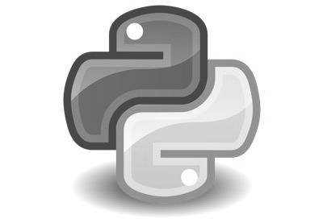
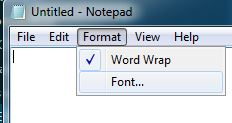
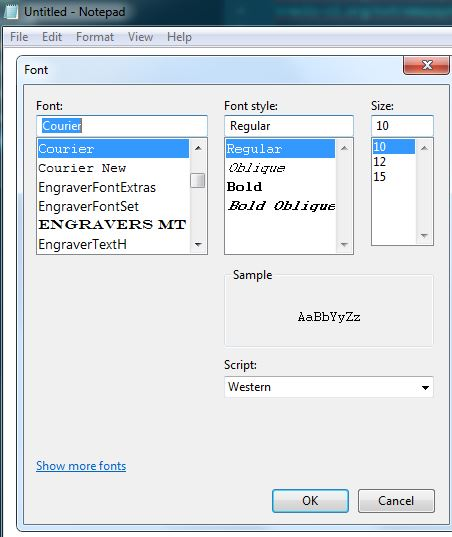
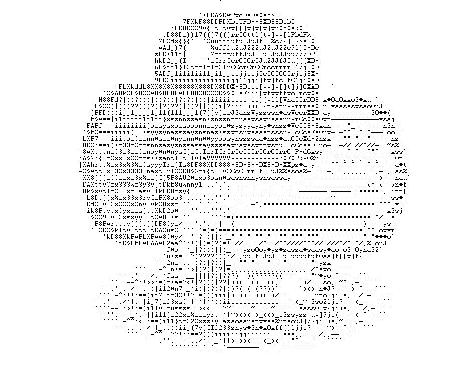

# py-generate-ascii

[](https://opensource.org/licenses/MIT)  [](https://github.com/ambv/black) [](http://makeapullrequest.com) [](https://travis-ci.org/extremepayne/py-generate-ascii) [](https://codecov.io/gh/extremepayne/py-generate-ascii) [](https://www.codacy.com/app/extremepayne/py-generate-ascii?utm_source=github.com&amp;utm_medium=referral&amp;utm_content=extremepayne/py-generate-ascii&amp;utm_campaign=Badge_Grade) [](https://github.com/defunctzombie/badginator)

> Generates Ascii art from an image

## Overview
This repo is a tool to transform an image into ASCII art. Follow these steps to generate the art:
1. Choose an image
3. Run `main.py`
4. Input the path to your image
5. Choose what character set you want the completed art to be in. I prefer the full character set (option "r") but some people think it looks neater with the other options.
6. Pick the size. 1 results in the largest possible, 3 is 1/3 of the size (in 12 pt. font, approx. the same size as original) and 5 is 1/5 the size of 1.
7. Open `output.txt` with notepad or a similar application and follow the steps in the section "Viewing the completed art" to change the font to courier.
8. Yay! You did it!

## Requirements
To use this, you must have:
Python [3.6.x](https://www.python.org/downloads/release/python-368/) or Python [3.7.x](https://www.python.org/downloads/release/python-373/) installed.

## Sample output
This image is included as a demo.



Using the demo example with option "n" and size 1, the following art is generated:
```text                                             
                                                                                                                                     
                                                                                                                                     
                                                        .*k$AXkAbAw$$$$D8bh~                                                         
                                                    lA$bAwDD8F$AAP0PDXDFX$$8DAbI                                                     
                                                 ;b8$8886v}v[vt[]ttt[[]v]t]*DkDXA8@                                                  
                                               '$X8DZl7{ll}v7l{]CICIt]}7v[vv][7ddFdw                                                 
                                              lAXbx}7l`  `xJuJuuuJuu2fu2JfOr{}t{lNDeX                                                
                                             `wdXj{l{      ofu2uu22JJf22Juf2ufr7{lNX$N                                               
                                             ybXz11j)      {I2rrufJf2f2JfJffffuf}{lXAP                                               
                                             ZA8u1j{c@   `.ICIcIIcCrCCc2J2Ju22I2l77$$D                                               
                                             5b$2jj7IItIJIIICIICIrcCrcCCIcCcrcIc17j8$$                                               
                                             YA8I1ji1ijji11jj111111j11jCrCCCrCIcjj1DDX                                               
                                             YF$Ciiiiiiiiiiiiiii1111jjit[]t[II[c1jiDD8                                               
                                   "wd8bwwb$XX8DDX$X$8$XXD8D88X$DDD$iii[][]tttvvj]C$bb   `           `                               
                                `D$k8PDwX88DbXXXADPAkkXDXDXX$8X8DdAbiiitt]t]][v3CcrAwb`         ``   `                               
                               &DX$b|((???()))(??)?)??(|?)|iiiiiiiii(ii7l]{}vV*zCIrXXbOOxOo3o3x3n3J- `                               
                              hXP8?|(((?(((|||??())((?()(|))(i()iii?(|(}7nzsa**VIrI$DwO%%Onx%xona*Oxyo ` `                           
                             ]Pd8)))i111jjjj1j1j}1j1jj11{7t[t]IcuxnszVyanzzasyyVCCc$8F3xn---------^3xnn|                             
                             FXP==)i11j11j1jjjjl%aanansnn***yayz**ynssnyynya*anVIIrDDP%Ox--'---------yy%j                            
                            FAP2===iiiiiiiitzanx*Ozaysn**znnyzzasaz**asaz*nz**yVICc$DFOon'--:!__"~-'-'az*'                           
                           'DF$===iiiii)3xznyanassa**y*ayzssasnyyyzanszsnsassnV2CIcXd83zx''./"::"::---^3x2`                          
                           F8dl===iiiv*%xoznzyz*nnsnynznnznsa*a*yszsnaynayaznsJcrr$d$cn3y'-'"/""//"/'..ozy,                          
                           8$X;=;i)yo%OOo3xa**nzyy*ssnsnyy*nnanz*sz*ass*zssa2rCrCk88Dozo-'.-":/","^"-'.<axJ                          
                          @XkX;;;**%OOxO%xxyznysysnzctCI[rIrcIICrrrccrrrcrIrC[r3$w$p%so;.''^^,^,:^^/^.'.*ns`                         
                          ;PkZ;7]x3O3Oo%3OOyas***]C[]tC[CnVVVVVVVVVVVVVVVVVVAXddAPVO3a>''',,^,^^^^^,^'.'o3a^                         
                          |Dw&C[[xoox%x3%O%z*szc]ctCaXXb$8DXX8DXD88$D$X$$D$X8$DUyxyx*.'.'^,^,^^,^^^,^-'')sa]                         
                          -8Xwv[t3oOoo3xO%xssx[]C]$8b8Xpoi[vtcrIu2JJffuufuJ%33Ozxan-..''-^^^,^,,^,,,,-',>zz%                         
                           8$DtvtOO%xx%O33xocvcv6ADwXuyOzy3zaassyna3o%za*ysys%33;'.'''----------^---,~:^~yzf                         
                           8wX[t[%3xo3oOo%n3]]v8bPDxxazn1-''..''.''..''.'.'.''.'.'.'-'------------/=;;^^!ay2                         
                           8b$o[vCxOooooOnst[Ikd8Dxss7.'.'.'.''''..'.'..''...'.'.'----------'-^>=====>^:isyt                         
                           -dA8v[[ooxxo%OOrtCIk8bOay^'..'..''.'...'.'-'.-''.'.'''.''--^/_;=====;=====/^,zOs-                         
                            Xk8vvvcooOxoxz[]tPXDyaou.@...''.''.'..'''.:;=)=;========================>:":s33`                         
                            1dXdt]v3xOos%a]]vDw$*yn_@@@..'..'''..:?=================================/:/%xyj                          
                             $8X4v]]ranonn[][Db8y*y"@@...''''';))====)=============================~":!O%x                           
                              PXkbIt[]tv[[v][DP8zn%:@@@.'''!=)==?================================|=""^an%"                           
                             ` X8XDdv][][vtv]Xk8ya3"@@@@'(|(==(==?===)===========================;//:OszJ                            
                                .k8X$8AkwFdbFAw8axn"``.|?=|?|==!""///:/"://""://"":":":"/":::":"":":s%Ox                             
                                   .u8kkAdkPwwkda3*^`"~?|?=?)=)<~:"!>/"::"//:":/""""/""/"/:""::"/;3oxa%                              
                                                oa3=/!_)(??|??(~:/;yaOxOs*annnsy*yaan*ynsyOynayzzaz3o.`                              
                                                3z*=":<(|(||)?|!_/;JJf2f2fJJu2ufuf2J2u3asvtt][]v{>`                                  
                                              `@%an=::>()??|||(~~//"::~~_~!~_~!>"::::"3*o `                                          
                                        `@@''.--xaa=//>?|((|(|?=;;;;;;;;;;;;;;;;;;;</"zno..@@`     `                                 
                                    `@@..--,::~!%*a=/_<|))|)||)(??(|?|()||)(i-@-||)":~Ozx^,--'..@`                                   
                                  `@'.--,/_<>;=?onz=~_~i)(|)?)(((|?)|??())?,     -):</Oao>~_//,-..@@`                                
                                `@..-^":_<;=))i13zsl<_!(?)?))|??()?)(??((|)`    ``__>:ns3==;<<_/^-'.@@`                              
                               `@.'-,:<_;==)i1{[f%3x_~<!=i)?iii()||(()?|()(" @ ` ._!"sa3r1i?=;>_/^-'..@`                             
                              `@..--^/<_;=(ij{[ru33ao=~_~~!~?iiiiiiii))?iiij=,.-!~_)3n%371i)==;<>:,-.'@`                             
                              `@.'--^/~<;=)i1l[tcuO3**%[~!!!!><~>>!_~<~::_<>~_~<<sn*%or]}1i?=;~~~/,-'.@`                             
                               `@.''-^"<!;=|(i1lvCu2Osxoszz2;!<_>~!!_>_~!!:<1yasa*oOrt]l1i(=;<~!"^-.'@`                              
                                ``@..-,,:!!;==?ij1lvII2333**sxn*sxszsna%Oznxo*axuf[llji)(=;!<!:^-..@@`                               
                                   `@@.'-^,/>>_;;??iii7{[ttrfJooszo**%%sx*32f}l7jji?==;;<~:"^-..'@``                                 
                                      `@@...-,^::!_>;;==???|ij1jiiiiiiiiiii)|===;;!_~!:^,--'.'@`                                     
                                           `@@...'--,,,/"!<~>~_>>!>___!<!_!~!/""^,--'..'@@``                                         
                                                 ```@@@''.'.'..--------..'.'...@@@```                                                
                                                                                                                                     
```

## Viewing the completed art
Be sure to use Courier. You can view text in courier like this (on a windows computer):




This is what the above example would look like in Courier:


